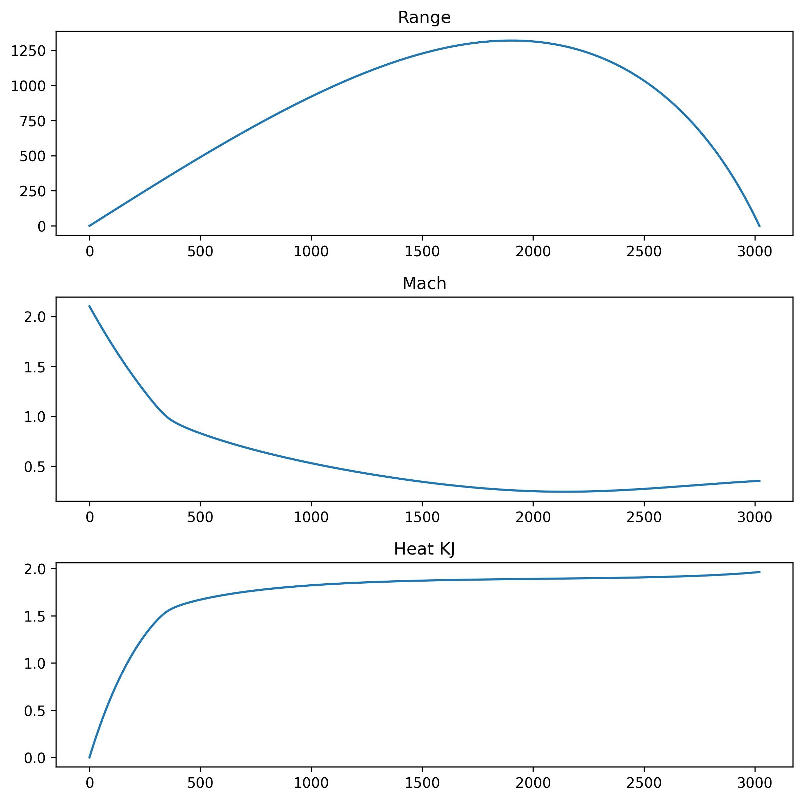

# Ballistic Trajectory Calculator

This program implements the external ballistic 
model described 
in [this paper](https://github.com/mazonka/artill/raw/master/drag_anziam.pdf).

The program is written in standard C++ with 
one library dependency on [Dlib](http://dlib.net/) that is included.




## What can you do with this program

1. Run ballistic trajectories with different options: 
wind, air turbulences, initial height above the Earth's surface;
even send to space or orbit around the Earth.

2. Solve for ranges or max - the programs finds 
the angles (for both flat and high trajectories) for a given range.

3. Tune the drag coefficient function given some firing table data.

In order to do this you must:

1. Define basic parameters of the projectile: mass, 
diameter, length; and muzzle velocity.

2. Define drag coefficient function. If the function 
is not known, there is an option to generate this 
function from empirical data. See section Solve.

## Included in the model

1. 3D trajectory
2. Earth’s curvature
3. Altitude: air density and temperature
4. Range and cross wind
5. Air turbulence


---------------------------
 
## How to build 

Clone this repo. Make build.sh executable:
```sh
chmod +x build.sh
```

```sh
./build.sh
```

## How to run

See User Guide


## Purpose of this Repository

Provide a simple Jupyter Notebook that diplays ballistic trajectories of projectiles. 

This repository is a clean fork of Oleg Mazonka's C++ library Artill. I decided to make a clean upload with a simple Jupyter Notebook as a simple user interface in order to improve the user experience of this repository. 

## Acknowledgements:

The C++ portion of this repo was created by Oleg Mazonka
https://github.com/mazonka/artill
